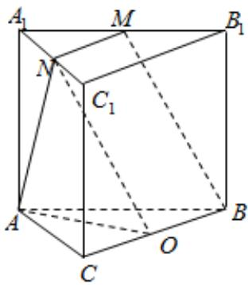

> [!faq]- 2024-2025学年内蒙古锡林郭勒盟二中高一（下）期末数学试卷解析
>
> > [!success]- **【答案】** C
>
> > [!note]- **【解析】**
> > 直三棱柱 $ABC-A_{1}B_{1}C_{1}$ 中， $\angle BCA=90^{\circ}$ ，M，N分别是 $A_{1}B_{1}$ ， $A_{1}C_{1}$ 的中点，如图：BC的中点为O，连结ON，
> >
> > $MN \stackrel {\|}{=} \frac{1}{2} B_{1}C_{1} = OB$ ，则 $MNOB$ 是平行四边形， $BM$ 与 $AN$ 所成角就是 $\angle ANO$
> >
> > $$
> > \because B C = C A = C C _ {1}
> > $$
> >
> > 设 $BC = CA = CC_{1} = 2$ ， $\therefore CO = 1$ ， $AO = \sqrt{5}$ ， $AN = \sqrt{5}$
> >
> > $$
> > M B = \sqrt {B _ {1} M ^ {2} + B B _ {1} ^ {2}} = \sqrt {(\sqrt {2}) ^ {2} + 2 ^ {2}} = \sqrt {6},
> > $$
> >
> > 在 $\triangle ANO$ 中，由余弦定理可得：
> >
> > $$
> > \cos \angle A N O = \frac {A N ^ {2} + N O ^ {2} - A O ^ {2}}{2 A N \bullet N O} = \frac {6}{2 \times \sqrt {5} \times \sqrt {6}} = \frac {\sqrt {3 0}}{1 0}.
> > $$
> >
> > 故选：C.
> >
> > 
