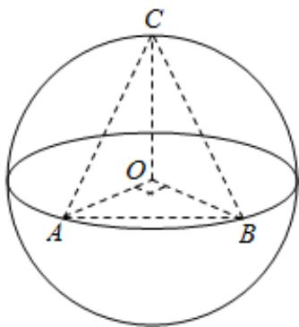

> [!faq]- 2024-2025学年内蒙古锡林郭勒盟二中高一（下）期末数学试卷解析
>
> > [!success]- **【答案】** C
>
> > [!note]- **【解析】**
> > 如图所示，当点C位于垂直于面AOB的直径端点时，三棱锥O-ABC的体积最大，设球O的半径为R，此时
> >
> > 故选：C.
> >
> > $V_{O - ABC} = V_{C - AOB} = \frac{1}{3}\times \frac{1}{2}\times R^2\times R = \frac{1}{6} R^3 = 36$ ，故 $R = 6$ ，则球
> >
> > $O$ 的表面积为 $4\pi R^2 = 144\pi$
> >
> > 
