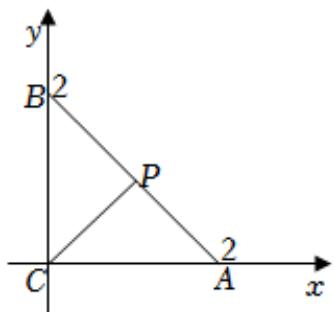

> [!faq]- 2024-2025学年内蒙古锡林郭勒盟二中高一（下）期末数学试卷解析
>
> > [!success]- **【答案】** 4
>
> > [!note]- **【解析】**
> > 由题意可建立如图所示的平面直角坐标系，
> >
> > 可得 $A(2,0), B(0,2), P(1,1), C(0,0)$
> >
> > $$
> > \overrightarrow {C P} \cdot \overrightarrow {C B} + \overrightarrow {C P} \cdot \overrightarrow {C A} = (1, 1) \cdot (0, 2) + (1, 1) \cdot (2, 0) = 2 + 2 = 4.
> > $$
> >
> > 故答案为：4.
> >
> > 
