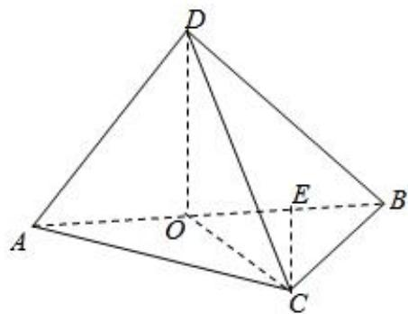

> [!faq]- 2024-2025学年内蒙古锡林郭勒盟二中高一（下）期末数学试卷解析
>
> > [!success]- **【答案】** ①③
>
> > [!note]- **【解析】**
> > ①取AB中点O，连接DO、CO，
> >
> > $$
> > \because A D = B D = \sqrt {2}, \therefore D O = 1, A B = 2, O C = 1
> > $$
> >
> > ∵平面ABD⊥平面ABC，DO⊥AB，∴DO⊥平面ABC，DO⊥OC，○
> >
> > $\therefore DC = \sqrt{2}$ ，①正确；
> >
> > ②若 $AB\perp CD$ ，则 $AB\perp$ 平面CDO， $AB\perp OC$ ，∵O为中点，
> >
> > $\therefore AC = BC, \angle BAC = 45^{\circ}$ 与 $\angle BAC = 30^{\circ}$ 矛盾，∴②错误；
> >
> > ③当 $DO \perp$ 平面ABC时，棱锥的高最大，此时
> >
> > 
> >
> > $$
> > V _ {\text {棱锥}} = \frac {1}{3} \times \frac {1}{2} \times A C \times B C \times D O = \frac {1}{6} \times \sqrt {3} \times 1 \times 1 = \frac {\sqrt {3}}{6}. \tag {③正确}
> > $$
> >
> > 故答案是①③
