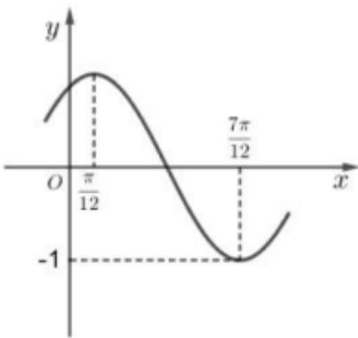

<!-- question-source:start -->
3、已知函数 $f(x)=\sin(\omega x+\varphi)(\omega>0,\left|\varphi\right|<\frac{\pi}{2})$ 的部分图象如图所示，则（）
A $\omega=2$ B $\varphi=\frac{\pi}{6}$

C $(- \frac{\pi}{6}, 0)$ 是函数 $f(x)$ 图象的一个对称中心

D $f(x)$ 的图象可由 $y = \sin 2x$ 的图象向左平移 $\frac{\pi}{3}$ 个单位得到
<!-- question-source:end -->

![[Q00091966A1]]
