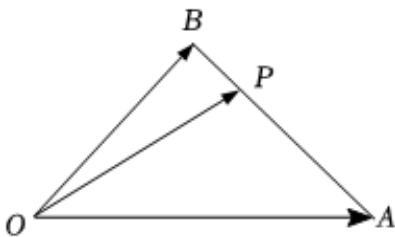

<!-- question-source:start -->
3、如图，在 $\triangle OAB$ 中， $P$ 为线段 $AB$ 上一点，则 $\overrightarrow{OP} = x\overrightarrow{OA} + y\overrightarrow{OB}$ ，若 $\overrightarrow{AP} = 3\overrightarrow{PB}$ ， $|\overrightarrow{OA}| = 4$ ， $|\overrightarrow{OB}| = 2$ ，且 $\overrightarrow{OA}$ 与 $\overrightarrow{OB}$ 的夹角为 $60^{\circ}$ ，则 $\overrightarrow{OP} \cdot \overrightarrow{AB}$ 的值为\_\_\_\_.

<!-- question-source:end -->

![[Q00091969A1]]
