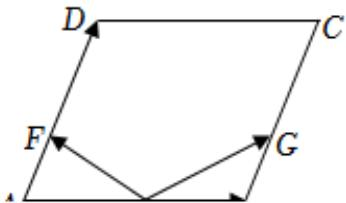

<!-- question-source:start -->
4、

如图，在平行四边形ABCD中，点E是AB的中点，点F，G分别是AD，BC的三等分点 $\left(AF=\frac{1}{3}AD\right.$ ， $BG=\frac{1}{3}BC.$ 设 $\overrightarrow{AB}=\overrightarrow{a}$ ， $\overrightarrow{AD}=\overrightarrow{b}$ .

1 用 $\overrightarrow{a}$ , $\overrightarrow{b}$ 表示 $\overrightarrow{EF}$ , $\overrightarrow{EG}$ ;

2 如果 $|\overrightarrow{b}| = \frac{3}{2} |\overrightarrow{a} |$ ， $EF$ ， $EG$ 有什么位置关系？用向量方法证明你的结论.
<!-- question-source:end -->

![[Q00091973A1]]
