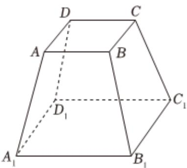

<!-- question-source:start -->
7、如图，某实心零部件的形状是正四棱台，已知 $AB = 8cm$ ， $A_{1}B_{1} = 20cm$ ，棱台的高为 $8cm$ ，现需要对该零部件的表面进行防腐处理，若每平方厘米的防腐处理费用为0.5元，则该零部件的防腐处理费用是（）A 640元B 512元C 390元D 347.5元

<!-- question-source:end -->

![[Q00092477A1]]
