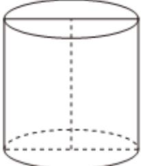
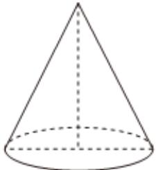
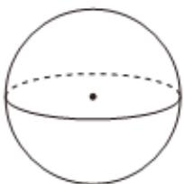

<!-- question-source:start -->
3、如图，一个圆柱和一个圆锥的底面直径和它们的高都与一个球的直径2R相等，下列结论正确的是（）

A 圆柱的侧面积为 $4\pi R^2$ B 圆锥的侧面积为 $\sqrt{5}\pi R^2$ C 圆柱的体积等于圆锥与球的体积之和  
D 三个几何体的表面积中，球的表面积最小
<!-- question-source:end -->

![[Q00092481A1]]
