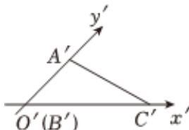

<!-- question-source:start -->
2、

$$
R t \triangle A B C
$$

$$
A ^ {\prime} B ^ {\prime} C ^ {\prime}
$$

$$
B ^ {\prime} C ^ {\prime} = 4
$$

$A^{\prime}B^{\prime}=2.$

1 画出 $Rt\triangle ABC$ 的原图并求其面积；

2 若以 $Rt\triangle ABC$ 的边 $BA$ 为旋转轴旋转一周，求所得几何体的体积和表面积.
<!-- question-source:end -->

![[Q00092486A1]]
