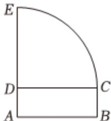

<!-- question-source:start -->
4、

如图，在矩形ABCD和四分之一的 $\odot D$ 拼接的平面图形中， $AD = 1$ ， $DC = DE = 3$ 将该图形绕AE所在直线旋转一周形成的面所围成的旋转体记为Γ.

1 求 $\Gamma$ 的体积；

2 求 $\Gamma$ 的表面积.
<!-- question-source:end -->

![[Q00092488A1]]
