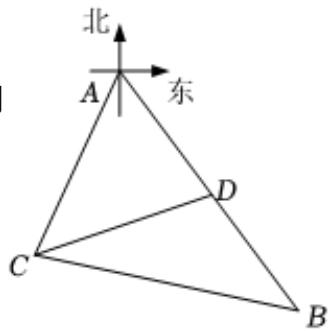

<!-- question-source:start -->
5、

如图，观测站C在目标A的南偏西 $20^{\circ}$ 方向，经过A处有一条南偏东 $40^{\circ}$ 走向的公路，在C处观测到与C相距31km的B处有一人正沿此公路向A处行走，走20km到达D处，此时测得C，D相距21km.

1 求 $\sin \angle BDC$ ；

2 求D，A之间的距离.
<!-- question-source:end -->

![[Q00092489A1]]
