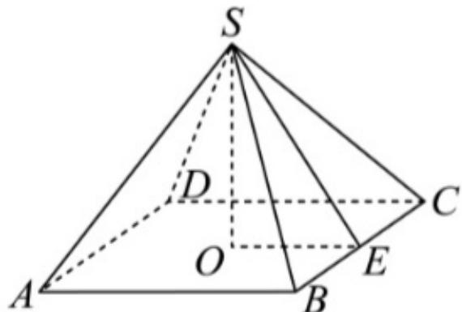

> [!faq]- 2024-2025学年青海省海南州高级中学高一（下）第二次月考数学试卷（6月份）解析
>
> > [!success]- **【答案】** A
>
> > [!note]- **【解析】**
> > 如图，正四棱锥 $S - ABCD$ ， $BC = 6$ ， $O$ 为底面正方形中心， $E$ 为 $BC$ 中点，
> >
> > 
> >
> > 由已知可得 $4 \times \frac{1}{2} \times 6 \times SE = 6 \times 6 \times 2$ ，所以 $SE = 6$ ，又 $OE = 3$ ，
> >
> > 所以 $SO = \sqrt{SE^2 - OE^2} = 3\sqrt{3}$ ，所以正四棱锥的体积为 $V = \frac{1}{3} \times 6 \times 6 \times 3\sqrt{3} = 36\sqrt{3}$ .
> >
> > 故选：A.
