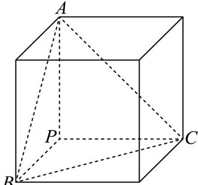

> [!faq]- 2024-2025学年青海省海南州高级中学高一（下）第二次月考数学试卷（6月份）解析
>
> > [!success]- **【答案】** B
>
> > [!note]- **【解析】**
> > 由于 $PA = PB = PC$ ， $PA$ ， $PB$ ， $PC$ 两两垂直，将该三棱锥放入正方体中，如图：
> >
> > 
> >
> > 故该三棱锥的外接球与正方体的外接球相同，
> >
> > 故该三棱锥外接球的直径 $2R = \sqrt{3} PA = \sqrt{3} \times \sqrt{3} = 3$
> >
> > 所以 $R=\frac{3}{2}$ ，
> >
> > 所以外接球的体积 $V=\frac{4\pi}{3}R^{3}=\frac{4\pi}{3}\times\left(\frac{3}{2}\right)^{3}=\frac{9\pi}{2}.$
> >
> > 故选：B.
