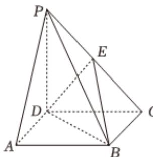

<!-- question-source:start -->
4、  

如图，在四棱锥 $P - ABCD$ 中，底面ABCD是正方形， $PD\bot$ 底面ABCD

， $PD = AB = 1$ ， $E$ 是 $PC$ 的中点

1 求证： $PA \parallel$ 平面EDB；

2 求直线 $PB$ 与平面 $EDB$ 的夹角的正弦值；

3 求点P到平面EDB的距离.
<!-- question-source:end -->

![[Q00091992A1]]
