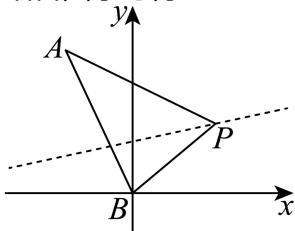

> [!faq]- 2025-2026学年内蒙古包头一中高二（上）期中数学试卷解析
>
> > [!success]- **【答案】** A
>
> > [!note]- **【解析】**
> > 由直线l整理得： $(x-2y+2)k+x+2y-6=0$ ，
> >
> > 由 $\left\{\begin{aligned}x-2y+2&=0\\ x+2y-6&=0\end{aligned}\right.$ ，解得 $\left\{\begin{aligned}x&=2\\ y&=2\end{aligned}\right.$
> >
> > 可得直线l恒过定点 $P(2,2)$
> >
> > 又点 $A(-1,5)$ ， $B(0,0)$ ，
> >
> > 则 $k_{PA}=\frac{5-2}{-1-2}=-1$ ， $k_{PB}=\frac{2-0}{2-0}=1$ ，
> >
> > 结合图象可得：
> >
> > 
> >
> > 若直线l与线段AB有公共点，则直线l斜率的取值范围为[-1,1]
> >
> > 由斜率定义 $k=\tan\alpha$ ，可得直线l倾斜角的取值范围为 $\left[0,\frac{\pi}{4}\right]\cup\left[\frac{3\pi}{4},\pi\right)$ .
