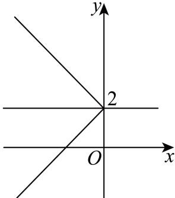
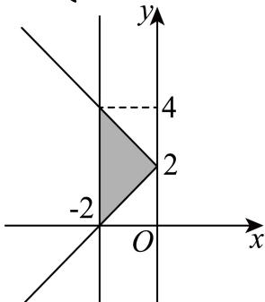

> [!faq]- 2025-2026学年内蒙古包头一中高二（上）期中数学试卷解析
>
> > [!success]- **【答案】** AD
>
> > [!note]- **【解析】**
> > 由 $|y - 2| \geqslant 0$ ，得一 $x \geqslant 0$ ，所以 $x \leqslant 0$ ，所以曲线 $C$ 不经过第一、四象限，故 $A$ 正确；当 $y - 2 \geqslant 0$ 时， $C$ 的方程为 $x + y - 2 = 0$ ，当 $y - 2 < 0$ 时， $C$ 的方程为 $x - y + 2 = 0$ ，作出曲线 $C$ 的图象，如图，
> >
> > 
> >
> > 可知 $C$ 关于直线 $\pmb{y} = 2$ 对称，不关于直线 $\pmb{y} = -2$ 对称，故 $B$ 错误；
> >
> > 由 $y = x$ 及 $|y - 2| = -x$ 得 $|y - 2| = -y$ ，所以 $\left\{ \begin{array}{l} y - 2 = -y \\ y \geqslant 2 \end{array} \right.$ 或 $\left\{ \begin{array}{l} 2 - y = -y \\ y < 2 \end{array} \right.$ ，
> >
> > 故方程组无解，所以直线 $y = x$ 与 $C$ 没有交点，故 $C$ 错误；
> >
> > 联立 $\left\{\begin{aligned}|y-2|=-x\\ x=-2\end{aligned}\right.$ ，得y=0或y=4，
> >
> > 
> >
> > 如图， $C$ 与直线 $\pmb{x} = -2$ 围成以 $(0,2)$ ， $(-2,0)$ ， $(-2,4)$ 为顶点的三角形，
> >
> > 其面积为 $\frac{1}{2} \times 4 \times 2 = 4$ ，故 $D$ 正确.
> >
> > 故选：AD.
