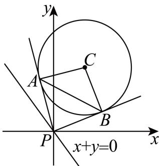

> [!faq]- 2025-2026学年内蒙古包头一中高二（上）期中数学试卷解析
>
> > [!success]- **【答案】** ABD
>
> > [!note]- **【解析】**
> > 已知圆 $C:(x - 1)^2 +(y - 3)^2 = 4$ 的圆心为 $(1,3)$ ，半径 $r = 2$
> >
> > 圆心 $C$ 到直线 $l$ 的距离为 $d = \frac{|1 + 3|}{\sqrt{1^2 + 1^2}} = 2\sqrt{2}.$
> >
> > 又点P为直线l:x+y=0上一动点，过点P向圆C引两条切线PA,PB，切点分别为A,B，
> >
> > 对于 $A$ ， $\left|PQ\right|_{min} = d - r = 2\sqrt{2} -2$ ，故 $A$ 正确；
> >
> > 对于 $B$ ，四边形PACB的面积
> >
> > 
> >
> > $$
> > S = \frac {1}{2} \times | P A | \times | A C | \times 2 = \sqrt {| P C | ^ {2} - | A C | ^ {2}} \times | A C | = \sqrt {| P C | ^ {2} - 2 ^ {2}} \times 2 =
> > $$
> >
> > $2\sqrt{|PC|^{2} - 4}$ ，要求四边形 $PACB$ 的面积的最小值，只需 $|PC|$ 最小，
> >
> > 又 $|PC|_{min}=d=2\sqrt{2}$ ，所以 $S_{min}=2\sqrt{(2\sqrt{2})^{2}-4}=4$ ，故B正确；
> >
> > 对于 $C$ ，当点 $P$ 在原点时， $\vert PC\vert = \sqrt{10}$ ， $PC$ 的中点坐标为 $(\frac{1}{2},\frac{3}{2})$
> >
> > 所以以 $PC$ 为直径的圆的方程为 $\left(x - \frac{1}{2}\right)^2 +\left(y - \frac{3}{2}\right)^2 = \left(\frac{\sqrt{10}}{2}\right)^2$ ，即 $x^{2} - x + y^{2} - 3y = 0$
> >
> > 把 $x^{2} - x + y^{2} - 3y = 0$ ，与 $(x - 1)^{2} + (y - 3)^{2} = 4$ 相减，可得直线 $AB$ 的方程为 $x + 3y - 6 = 0$ ，故 $C$ 错误；
> >
> > 对于 $D$ ，因为点 $P$ 为直线 $l:x + y = 0$ 上一动点，所以可设 $P(t, - t)$
> >
> > $|PC| = \sqrt{(1 - t)^2 + (3 + t)^2} = \sqrt{2t^2 + 4t + 10}$ , $PC$ 的中点坐标为 $\left(\frac{1 + t}{2}, \frac{3 - t}{2}\right)$
> >
> > 所以以 $PC$ 为直径的圆的方程为 $\left(x - \frac{1 + t}{2}\right)^2 +\left(y - \frac{3 - t}{2}\right)^2 = \left(\frac{\sqrt{2t^2 + 4t + 10}}{2}\right)^2$
> >
> > 即 $x^{2} - (t + 1)x + y^{2} + (t - 3)y - 2t = 0$ ，与 $(x - 1)^{2} + (y - 3)^{2} = 4$ 相减，
> >
> > 可得直线 $AB$ 的方程为 $(t - 1)x - (t + 3)y + 6 + 2t = 0$ ，即 $t(x - y + 2) - (x + 3y - 6) = 0$ ，由 $\left\{ \begin{array}{l}x - y + 2 = 0,\\ x + 3y - 6 = 0, \end{array} \right.$ 解得 $\left\{ \begin{array}{l}x = 0\\ y = 2 \end{array} \right.$ ，所以直线 $AB$ 过定点(0,2)，故 $D$ 正确.
> >
> > 故选：ABD.
