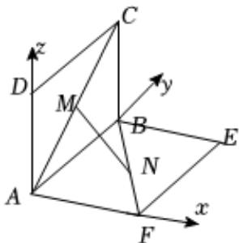

> [!faq]- 2025-2026学年内蒙古包头一中高二（上）期中数学试卷解析
>
> > [!success]- **【答案】** $\left[\frac{\sqrt{2}}{2},1\right)$
>
> > [!note]- **【解析】**
> > 由题意，以A坐标原点，以AF，AB，AD所在的直线分别为x，y，z轴建立空间直角坐标系，则 $A(0,0,0)$ ， $F(1,0,0)$ ， $B(0,1,0)$ ， $D(0,0,1)$ ， $C(0,1,1)$ ， $E(1,1,0)$ ，
> >
> > 
> >
> > 因为CM = BN = a(0 < a < $\sqrt{2}$ )，可得 $\overrightarrow{AM} = \frac{\sqrt{2} - a}{\sqrt{2}} \overrightarrow{AC}$ ，可得 $M(0, \frac{\sqrt{2} - a}{\sqrt{2}}, \frac{\sqrt{2} - a}{\sqrt{2}})$ ，
> >
> > $\overrightarrow{BN} = \frac{a}{\sqrt{2}}\overrightarrow{BF} = \frac{a}{\sqrt{2}} (1, - 1,0)$ ，可得 $N(\frac{a}{\sqrt{2}},\frac{\sqrt{2} - a}{\sqrt{2}},0)$
> >
> > $$
> > | M N | = \sqrt {(0 - \frac {a}{\sqrt {2}}) ^ {2} + 0 ^ {2} + (\frac {\sqrt {2} - a}{\sqrt {2}}) ^ {2}} = \sqrt {a ^ {2} - \sqrt {2} a + 1} = \sqrt {(a - \frac {\sqrt {2}}{2}) ^ {2} + \frac {1}{2}}
> > $$
> >
> > 因为 $a\in(0,\sqrt{2})$ ，可得 $|MN|\in[\frac{\sqrt{2}}{2},1)$ .
> >
> > 故答案为： $\left[\frac{\sqrt{2}}{2},1\right)$
