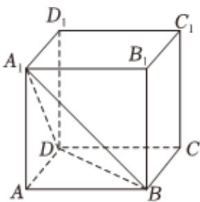

<!-- question-source:start -->
6、在平面直角坐标系 $xOy$ 中，已知圆 $A:(x - 3)^2 +y^2 = 100$ （圆心为 $A$ ），点 $B(-3,0)$ ，点 $P$ 在圆 $A$ 上运动，设线段 $PB$ 的垂直平分线和直线 $PA$ 的交点为 $Q$ ，则点 $Q$ 的轨迹方程为（）  
A $\frac{x^2}{16} +\frac{y^2}{7} = 1$ B $\frac{x^2}{25} +\frac{y^2}{16} = 1$ C $\frac{x^2}{7} +\frac{y^2}{16} = 1$ D $\frac{x^2}{16} +\frac{y^2}{25} = 1$

<!-- question-source:end -->

![[Q00092499A1]]
