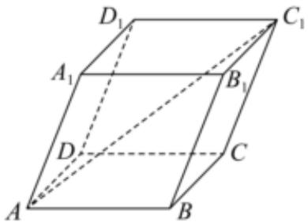

<!-- question-source:start -->
12、如图所示，在四棱柱 $ABCD - A_{1}B_{1}C_{1}D_{1}$ 中，底面为平行四边形，以顶点 $\mathbf{A}$ 为端点的三条棱长都为1，且两两夹角为 $60^{\circ}$ ，则 $AC_{1}$ 的长为（）

A $\sqrt{3}$ B 2 C $\sqrt{5}$ D $\sqrt{6}$
<!-- question-source:end -->

![[Q00092505A1]]
