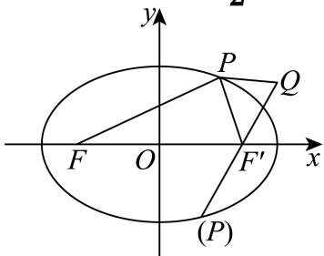

> [!faq]- 2025-2026学年内蒙古包头九中外国语学校高二（上）月考数学试卷（12月份）解析
>
> > [!success]- **【答案】** A
>
> > [!note]- **【解析】**
> > 如图，设椭圆 $C: \frac{x^2}{2} + y^2 = 1$ 的右焦点为 $F'$ ，则 $F'(1,0)$ ，
> >
> > 
> >
> > 根据椭圆的定义可得 $\left|PF'\right| + \left|PF\right| = 2a = 2\sqrt{2}$ ，
> >
> > $$
> > | P Q | + | P F | = | P Q | + 2 a - | P F ^ {\prime} | \leq 2 a + | Q F ^ {\prime} | = 2 \sqrt {2} + \sqrt {(4 - 1) ^ {2} + 4 ^ {2}} = 5 + 2 \sqrt {2}
> > $$
> >
> > 当且仅当 $P, F'$ , $Q$ 三点共线, 且 $F'$ 在 $PQ$ 之间时取等号,
> >
> > 所以 $(|PQ| + |PF|)_{\max} = 5 + 2\sqrt{2}$ .
> >
> > 故选：A.
