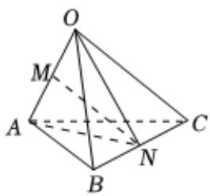

> [!faq]- 2025-2026学年内蒙古包头九中外国语学校高二（上）月考数学试卷（12月份）解析
>
> > [!success]- **【答案】** C
>
> > [!note]- **【解析】**
> > 如图所示，连接 $ON$ ， $AN$ ，  
> > 则 $\overrightarrow{ON} = \frac{1}{2} (\overrightarrow{OB} +\overrightarrow{OC}) = \frac{1}{2} (\overrightarrow{b} +\overrightarrow{c})$ ， $\overrightarrow{AN} = \frac{1}{2} (\overrightarrow{AC} +\overrightarrow{AB})$ $= \frac{1}{2} (\overrightarrow{OC} -2\overrightarrow{OA} +\overrightarrow{OB})$ $= \frac{1}{2} (-2\overrightarrow{a} +\overrightarrow{b} +\overrightarrow{c})$ $= -\overrightarrow{a} +\frac{1}{2}\overrightarrow{b} +\frac{1}{2}\overrightarrow{c},$ 所以 $\overrightarrow{MN} = \frac{1}{2} (\overrightarrow{ON} +\overrightarrow{AN}) = -\frac{1}{2}\overrightarrow{a} +\frac{1}{2}\overrightarrow{b} +\frac{1}{2}\overrightarrow{c}.$
> >
> > 
> >
> > 故选：C.
