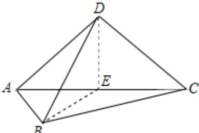

> [!faq]- 2025-2026学年内蒙古包头九中外国语学校高二（上）月考数学试卷（12月份）解析
>
> > [!success]- **【答案】** $90^{\circ}$
>
> > [!note]- **【解析】**
> > 取AC的中点E，连接DE，BE，
> >
> > 
> >
> > ∵ ABCD 是正方形，
> >
> > $$
> > \therefore A C \perp B E, A C \perp D E.
> > $$
> >
> > $$
> > \because B E \cap D E = E
> > $$
> >
> > $\therefore AC \perp$ 面 $BDE$
> >
> > $$
> > \because B D \subset \text {面} B D E
> > $$
> >
> > $$
> > \therefore A C \perp B D
> > $$
> >
> > ∴异面直线AC，BD的所成角为90°.
> >
> > 故答案为： $90^{\circ}$
