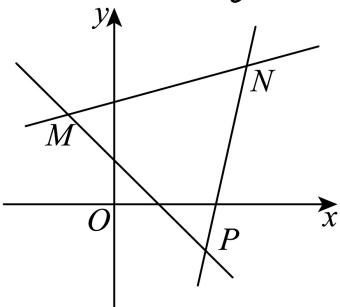

> [!faq]- 2025-2026学年内蒙古包头九中外国语学校高二（上）月考数学试卷（12月份）解析
>
> > [!success]- **【答案】** $(-∞,-1]∪[4,+∞)$
>
> > [!note]- **【解析】**
> > 直线 $l: kx - y - 2k - 1 = 0$ ，即 $k(x - 2) - (y + 1) = 0$ ，所以直线 $l$ 过定点 $P(2, -1)$
> >
> > 
> >
> > 如图， $M(-1,2),N(3,3),k_{PM} = \frac{-1 - 2}{2 + 1} = -1,k_{PN} = \frac{3 + 1}{3 - 2} = 4.$
> >
> > 因直线l与线段AB相交，则由图可知 $k\leqslant-1$ 或 $k\geqslant4$ .
> >
> > 故答案为： $(-∞,-1]∪[4,+∞)$ .
