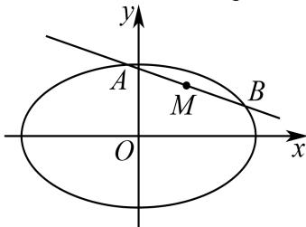

> [!faq]- 2025-2026学年内蒙古包头九中外国语学校高二（上）月考数学试卷（12月份）解析
>
> > [!success]- **【答案】** 详见解析
>
> > [!note]- **【解析】**
> > 详见解析
> >
> > (1)设 $C$ 的半焦距为 $\pmb{c}$ ，则依题意有 $\left\{ \begin{array}{l} 2a = 2\sqrt{3} b \\ 2c = 4 \\ a^2 = b^2 + c^2 \end{array} \right.$ ，解得 $\left\{ \begin{array}{l} a = \sqrt{6} \\ b = \sqrt{2} \\ c = 2 \end{array} \right.$
> >
> > 所以椭圆C的方程为 $\frac{x^{2}}{6}+\frac{y^{2}}{2}=1.$
> >
> > (2)设 $A(x_{1},y_{1})$ ， $B(x_{2},y_{2})$ ，因为 $M(1,1)$ 是线段 $AB$ 的中点，
> >
> > 所以 $x_{1} + x_{2} = 2$ ， $y_{1} + y_{2} = 2$
> >
> > 因为点A，B在C上，所以 $\left\{\begin{aligned}x_{1}^{2}+3y_{1}^{2}&=6,\\ x_{2}^{2}+3y_{2}^{2}&=6,\end{aligned}\right.$ 两式相减得 $x_{1}^{2}-x_{2}^{2}+3(y_{1}^{2}-y_{2}^{2})=0$ ，
> >
> > 所以 $\frac{y_1 - y_2}{x_1 - x_2} = -\frac{x_1 + x_2}{3(y_1 + y_2)} = -\frac{2}{3 \times 2} = -\frac{1}{3}$ .
> >
> > 即直线 $l$ 的斜率为 $-\frac{1}{3}$ ，所以直线 $l$ 的方程为 $y - 1 = -\frac{1}{3} (x - 1)$ ，即 $x + 3y - 4 = 0$ .
> >
> > 
