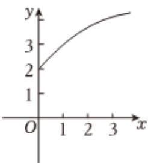

<!-- question-source:start -->
3、已知函数 $f(x)$ 的图象如图所示，下列正确的是（）

A $f^{\prime}(2) <   f^{\prime}(3) <   f(3) - f(2)$ B $f(3) - f(2) <   f^{\prime}(2) <   f^{\prime}(3)$ C $f^{\prime}(3) <   f^{\prime}(2) <   f(3) - f(2)$ D $f^{\prime}(3) <   f(3) - f(2) <   f^{\prime}(2)$
<!-- question-source:end -->

![[Q00092521A1]]
