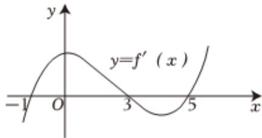

<!-- question-source:start -->
1、如图是导函数 $y = f'(x)$ 的图象，则下列说法正确的是（）

A $(-1,3)$ 为函数 $y = f(x)$ 的单调递增区间  
B $(3,5)$ 为函数 $y = f(x)$ 的单调递减区间  
C 函数 $y = f(x)$ 在 $x = 0$ 处取得极大值  
D 函数 $y = f(x)$ 在 $x = 5$ 处取得极小值
<!-- question-source:end -->

![[Q00092527A1]]
