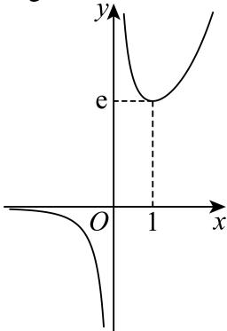

> [!faq]- 2025-2026学年内蒙古包头九中外国语学校高二（下）月考数学试卷（4月份）解析
>
> > [!success]- **【答案】** $(\frac{e}{2}, + \infty)$
>
> > [!note]- **【解析】**
> > 由题意函数 $f(x) = e^{x} - ax^{2}$ 有两个极值点，
> > 对函数求导可得 $f'(x) = e^{x} - 2ax$ ，令 $f'(x) = 0$ 可得 $2a = \frac{e^x}{x}$ ，因为 $f(x) = e^{x} - ax^{2}$ 有两个极值点，所以 $f'(x) = e^{x} - 2ax$ 有两个变号零点，令 $g(x) = \frac{e^x}{x}$ ，则 $g'(x) = \frac{e^x(x - 1)}{x^2}$ ，当 $x > 1$ 时， $g'(x) > 0$ ， $g(x)$ 单调递增，当 $0 < x < 1$ 时， $g'(x) < 0$ ， $g(x)$ 单调递减，当 $x < 0$ 时， $g'(x) < 0$ ， $g(x)$ 单调递减，当 $x$ 趋近于 $-\infty$ 时， $g(x)$ 趋近于 $0$ ，当 $x$ 趋近于 $+\infty$ 时， $g(x)$ 趋近于 $+\infty$ ，当 $x$ 从负半轴趋近于0时， $g(x)$ 趋近于 $-\infty$ ，当 $x$ 从正半轴趋近于0时， $g(x)$ 趋近于 $+\infty$ ，又 $g(1) = e$ ，简图如下，
> >
> > 
> >
> > 由图可知， $2a > e$ ，即实数 $\pmb{a}$ 的取值范围是 $(\frac{e}{2}, +\infty)$
> >
> > 故答案为： $(\frac{e}{2}, + \infty)$
