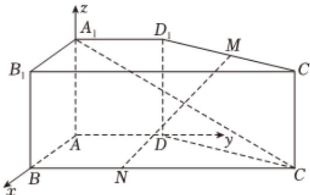

<!-- question-source:start -->
2、在直四棱柱 $ABCD - A_1B_1C_1D_1$ 中， $AB \perp AD$ ， $AD // BC$ ， $AB = AD = AA_1 = 1$ ， $BC = 3$ ， $M$ 是 $C_1D_1$ 的中点， $\overrightarrow{BN} = \frac{1}{2}\overrightarrow{NC}$ ，以 $A$ 为坐标原点， $AB$ ， $AD$ ， $AA_1$ 所在直线分别为 $x$ ， $y$ ， $z$ 轴，建立如图所示的空间直角坐标系

1 直接写出点 $A_{1}, C, M, N$ 的坐标

2 求 $\overrightarrow{A_1C} \cdot \overrightarrow{MN}$

3 求点N到直线 $A_{1}C$ 的距离
<!-- question-source:end -->

![[Q00092538A1]]
