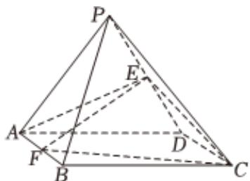

<!-- question-source:start -->
4、  

如图，在四棱锥 $P - ABCD$ 中，底面ABCD是边长为4的正方形，侧面

PAD是正三角形，侧面PAD⊥底面ABCD，E，F分别是PD，AB的中点.

1 证明：AE⊥平面PCD.

2 求平面EFC与平面ABCD夹角的余弦值.

3 若 $H$ ， $Q$ 分别是直线 $AE$ ， $CF$ 上的一个动点，求 $HQ$ 长度的最小值.
<!-- question-source:end -->

![[Q00092540A1]]
