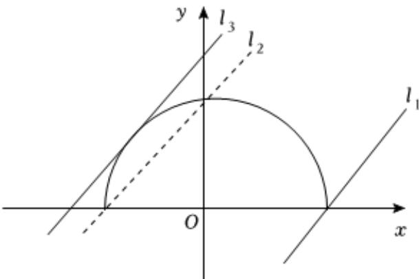

> [!faq]- 2025-2026学年内蒙古包头九中高二（上）期中数学试卷解析
>
> > [!success]- **【答案】** A
>
> > [!note]- **【解析】**
> > 曲线 $y=\sqrt{9-x^{2}}$ 可变形为 $x^{2}+y^{2}=9$ ，其中 $y\geqslant0$ ，又直线y=x-m与曲线 $y=\sqrt{9-x^{2}}$ 只有一个公共点，其对应的图象如图所示：
> >
> > 由题意可得： $l_{1}:y=x-3$ ， $l_{2}:y=x+3$ ， $l_{3}$ ：
> >
> > $$
> > y = x + 3 \sqrt {2}
> > $$
> >
> > 当 $m = -3\sqrt{2}$ 或 $-3 < m \leqslant 3$ 时，直线 $y = x - m$ 与曲线 $y = \sqrt{9 - x^2}$ 只有一个公共点.
> >
> > 故选：A.
> >
> > 
