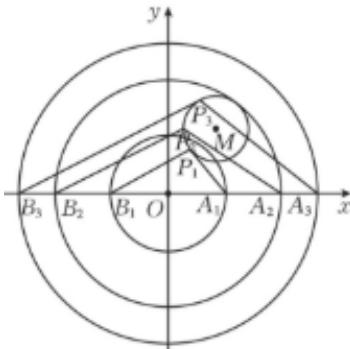

> [!faq]- 2025-2026学年内蒙古包头九中高二（上）期中数学试卷解析
>
> > [!success]- **【答案】** B
>
> > [!note]- **【解析】**
> > 如图，设圆 $O: x^2 + y^2 = a^2$
> >
> > 
> >
> > 当圆 $M$ 上存在点 $\pmb{P}$ ，使得 $\angle APB$ 为钝角，
> >
> > 则点 $P$ 在圆 $O$ 内，等价于圆 $O$ 与圆 $M$ 相交，内切或内含，
> >
> > 即 $a + 2 > |OM| = \sqrt{3^2 + 4^2} = 5$ ，解得 $a > 3$
> >
> > 则a的取值范围为 $(3,+\infty)$ .
> >
> > 故选：B.
