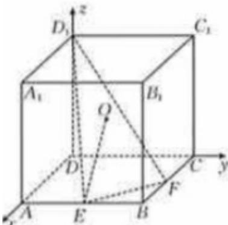

> [!faq]- 2025-2026学年内蒙古包头九中高二（上）期中数学试卷解析
>
> > [!success]- **【答案】** ABD
>
> > [!note]- **【解析】**
> > 由题意正方体 $ABCD - A_{1}B_{1}C_{1}D_{1}$ 外接球的半径为 $\sqrt{3}$ ，可得 $\frac{\sqrt{3} AB}{2} = \sqrt{3}$ ，得 $AB = 2$ ， $A$ 正确；以 $D$ 为原点， $DA, DC, DD_{1}$ 所在直线分别为 $x$ 轴、 $y$ 轴、 $z$ 轴，建立如图所示的空间直角坐标系，
> >
> > 
> >
> > $O(1,1,1),E(2,1,0),F(1,2,0),D_1(0,0,2)$
> >
> > 得 $\overrightarrow{OE} = (1, 0, -1)$ , $\overrightarrow{FD_1} = (-1, -2, 2)$ ,
> >
> > $$
> > | c o s \langle \overrightarrow {O E}, \overrightarrow {F D _ {1}} \rangle | = | \frac {\overrightarrow {O E} \cdot \overrightarrow {F D _ {1}}}{| \overrightarrow {O E} | | \overrightarrow {F D _ {1}} |} | = \frac {\sqrt {2}}{2}
> > $$
> >
> > 所以直线 $OE$ 与 $FD_{1}$ 所成的角为 $\frac{\pi}{4}$ ， $B$ 正确；
> >
> > $\overrightarrow{EF} = (-1, 1, 0)$ ，设平面 $EFD_{1}$ 的法向量为 $\overrightarrow{n} = (x, y, z)$ ，
> >
> > 则 $\left\{ \begin{array}{l} \overrightarrow{n} \cdot \overrightarrow{EF} = -x + y = 0 \\ \overrightarrow{n} \cdot \overrightarrow{FD_1} = -x - 2y + 2z = 0 \end{array} \right.$
> >
> > 令 $x = 2$ ，得 $y = 2$ ， $z = 3$ ，得 $\overrightarrow{n} = (2,2,3)$
> >
> > 所以点 $O$ 到平面 $EFD_{1}$ 的距离为 $\left|\frac{\overrightarrow{OE} \cdot \overrightarrow{n}}{|\overrightarrow{n}|}\right| = \frac{\sqrt{17}}{17}, C$ 错误；
> >
> > 平面 $EFD_{1}$ 截球O所得的截面是一个圆，
> >
> > 设该圆的半径为 $r$ ，则 $r^2 = (\sqrt{3})^2 -(\frac{\sqrt{17}}{17})^2 = \frac{50}{17}$
> >
> > 所以平面 $EFD_{1}$ 截球O所得截面的面积为 $\pi r^{2}=\frac{50\pi}{17}$ ，D正确.
> >
> > 故选：ABD.
