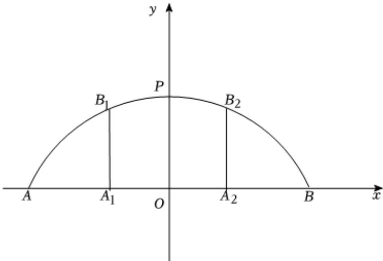

> [!faq]- 2025-2026学年内蒙古包头九中高二（上）期中数学试卷解析
>
> > [!success]- **【答案】** 7
>
> > [!note]- **【解析】**
> > 以O为原点，AB所在直线为x轴建立平面直角坐标系，
> >
> > 
> >
> > 设该圆弧所在圆为圆 $M: x^{2} + (y + b)^{2} = r^{2}$
> >
> > 将 $P(0,8)$ ， $B(12,0)$ 代入圆 $M$ 的方程，可得 $\left\{ \begin{array}{l}(8 + b)^2 = r^2,\\ 12^2 +b^2 = r^2, \end{array} \right.$ 解得 $\left\{ \begin{array}{l}b = 5\\ r = 13 \end{array} \right.,$
> >
> > 所以圆 $M:x^{2} + (y + 5)^{2} = 169$
> >
> > 当 $x = -5$ 时， $25 + (y + 5)^2 = 169$ ，解得 $y = 7$ 或 $-17$
> >
> > 结合图形，可知 $B_{1}(-5,7)$ ，即支柱 $A_{1}B_{1}$ 的高度为7m.
> >
> > 故答案为：7.
