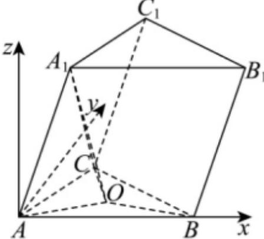

> [!faq]- 2025-2026学年内蒙古包头九中高二（上）期中数学试卷解析
>
> > [!success]- **【答案】** $\frac{\sqrt{6}}{2}$
>
> > [!note]- **【解析】**
> > 以A为坐标原点， $\overrightarrow{AB}$ 正方向为x轴正方向，在平面ABC内作y轴⊥AB，作z轴⊥平面ABC，可建立如图所示空间直角坐标系，
> >
> > 
> >
> > 因为 $AB = 3$ ， $AC = 2\sqrt{2}$ ， $\angle BAC = \frac{\pi}{4}$
> >
> > 所以 $A(0,0,0), B(3,0,0), C(2,2,0)$ ，设 $A_{1}(x,y,z)$
> >
> > 则 $\overrightarrow{AA_1} = (x, y, z)$ , $\overrightarrow{AB} = (3, 0, 0)$ , $\overrightarrow{AC} = (2, 2, 0)$ ,
> >
> > 因为 $\angle BAA_{1} = \frac{\pi}{4}$ ， $\angle CAA_{1} = \frac{\pi}{3}$ ， $AA_{1} = \sqrt{2}$
> >
> > $$
> > \cos \frac {\pi}{4} = \frac {\overrightarrow {A B} \cdot \overrightarrow {A A _ {1}}}{| \overrightarrow {A B} | \cdot | \overrightarrow {A A _ {1}} |} = \frac {3 x}{3 \sqrt {2}} = \frac {\sqrt {2}}{2}, \cos \frac {\pi}{3} = \frac {\overrightarrow {A C} \cdot \overrightarrow {A A _ {1}}}{| \overrightarrow {A C} | \cdot | \overrightarrow {A A _ {1}} |} = \frac {2 x + 2 y}{4} = \frac {1}{2}.
> > $$
> >
> > 所以x=1,y=0,
> >
> > 又 $x^{2}+y^{2}+z^{2}=2$ ，所以 $z^{2}=1$ ，由图可知z>0，所以z=1，
> > 所以 $A_{1}(1,0,1)$ ;
> >
> > 在平面直角坐标系 $xAy$ 中， $A(0,0)$ ， $B(3,0)$ ， $C(2,2)$
> >
> > 则 $AB$ 中点为 $\left(\frac{3}{2}, 0\right)$ , $AC$ 中点为 $(1, 1)$ ,
> >
> > 所以线段 $AB$ 垂直平分线方程为 $\pmb{x} = \frac{3}{2}$
> >
> > 线段 $AC$ 垂直平分线方程为 $\pmb {y} - 1 = -\left(\pmb {x} - 1\right)$ ，即 $\pmb {x} + \pmb {y} - 2 = 0$
> >
> > 由 $\left\{\begin{aligned}x&=\frac{3}{2}\\ x+y&-2=0\end{aligned}\right.$ 得： $\left\{\begin{aligned}x&=\frac{3}{2}\\ y&=\frac{1}{2}\end{aligned}\right.$ ，所以 $O\left(\frac{3}{2},\frac{1}{2},0\right),\overrightarrow{A_{1}O}=\left(\frac{1}{2},\frac{1}{2},-1\right)$
> >
> > 所以 $|\overrightarrow{A_1O}| = \sqrt{\frac{1}{4} + \frac{1}{4} + 1} = \frac{\sqrt{6}}{2}$ ，即 $A_{1}O$ 的长为 $\frac{\sqrt{6}}{2}$ .
> >
> > 故答案为： $\frac{\sqrt{6}}{2}$
