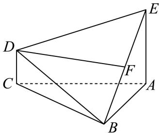

<!-- question-source:start -->
3. 如图，多面体 $ABCD$ 中， $EA \perp$ 平面 $ABC$ ， $DC \perp$ 平面 $ABC$ ， $EA = 2DC$ ， $F$ 是 $EB$ 的中点.

1 证明： $DF / /$ 平面ABC.

2 若 $EA = AB = 2$ ， $\angle BAC = 90^{\circ}$ ，且二面角 $B - DE - C$ 的余弦值为 $\frac{3\sqrt{19}}{19}$ ，求 $AC$ 的长
<!-- question-source:end -->

![[Q00092543A1]]
