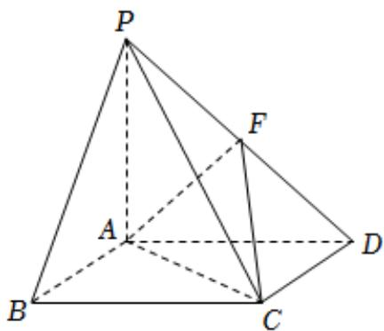

<!-- question-source:start -->
4. 如图，在四棱锥 $P - ABCD$ 中，底面ABCD是菱形， $PA \perp$ 平面ABCD，且 $PA = AB = 2$ ， $PD$ 的中点为 $F$ .

在线段 $AB$ 上是否存在一点 $G$ ，使得 $AF //$ 平面 $PCG$ ？若存在，指出 $G$ 的位置并给以证明；若不存在，请说明理由.

2 若 $FC$ 与平面 $ABCD$ 所成的角是 $\frac{\pi}{6}$ ，求二面角 $F - AC - D$ 的余弦值.
<!-- question-source:end -->

![[Q00092544A1]]
