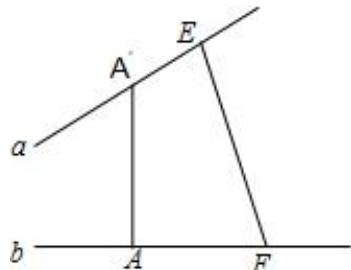

> [!faq]- 2025-2026学年内蒙古包头九中高二（上）期中数学试卷（1）解析
>
> > [!success]- **【答案】** B
>
> > [!note]- **【解析】**
> > 如图，设两条异面直线 $a$ ， $b$ 所成的角为 $\theta (0 <   \theta \leqslant \frac{\pi}{2})$
> >
> > $$
> > \because A A ^ {\prime} \perp a, A A ^ {\prime} \perp b, A ^ {\prime} E = 2, A F = 3, E \bar {F} = 5, A A ^ {\prime} = \sqrt {6},
> > $$
> >
> > $$
> > \therefore \overrightarrow {E F} = \overrightarrow {E A ^ {\prime}} + \overrightarrow {A ^ {\prime} A} + \overrightarrow {A F}
> > $$
> >
> > 则
> >
> > 
> >
> > $$
> > \overrightarrow {E F} ^ {2} = (\overrightarrow {E A ^ {\prime}} + \overrightarrow {A ^ {\prime} A} + \overrightarrow {A F}) ^ {2} = \overrightarrow {E A ^ {\prime}} ^ {2} + \overrightarrow {A ^ {\prime} A} ^ {2} + \overrightarrow {A F} ^ {2} + 2 \overrightarrow {E A ^ {\prime}} \bullet \overrightarrow {A ^ {\prime} A} + 2 \overrightarrow {E A ^ {\prime}} \bullet \overrightarrow {A F}
> > $$
> >
> > $$
> > + 2 \overrightarrow {A ^ {\prime} A} \bullet \overrightarrow {A F}
> > $$
> >
> > $$
> > \therefore 5 ^ {2} = 2 ^ {2} + (\sqrt {6}) ^ {2} + 3 ^ {2} \pm 2 \times 2 \times 3 \cos \theta ,
> > $$
> >
> > 得 $\cos \theta = -\frac{1}{2}$ （舍去）或 $\cos \theta = \frac{1}{2}$
> >
> > 则 $\theta = \frac{\pi}{3}$
> >
> > 故选：B.
