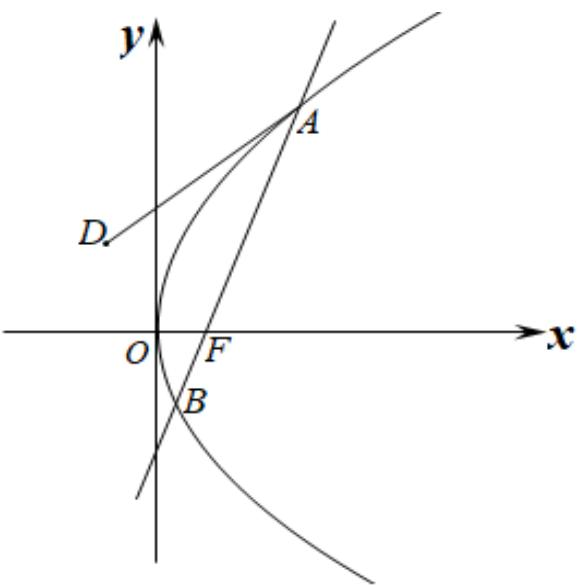
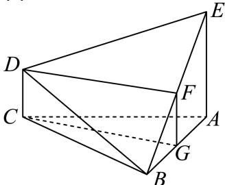
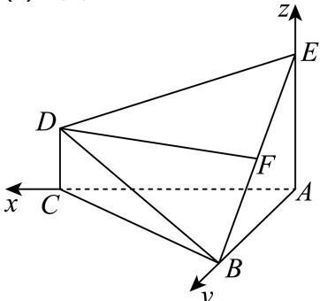

> [!faq]- 2025-2026学年内蒙古包头九中高二（上）期中数学试卷（1）解析
>
> > [!success]- **【答案】** 详见解析
>
> > [!note]- **【解析】**
> > 详见解析
> >
> > 
> >
> > (1)证明：取AB的中点G，连接GF，CG，
> >
> > 
> >
> > 因为 $F$ 为 $BE$ 中点，所以 $FG / / EA$ ， $FG = \frac{1}{2} EA = CD$
> >
> > 因为 $EA \perp$ 平面ABC，DC⊥平面ABC，所以DC//EA.
> >
> > 又因为 $FG//EA$ ，所以 $DC//FG$
> >
> > 所以四边形CGFD为平行四边形，
> >
> > 所以DF//CG；
> >
> > 因为 $DF \notin$ 平面 $ABC, CG \subset$ 平面 $ABC$
> >
> > 所以DF//平面ABC.
> >
> > (2)如图所示建立空间直角坐标系，设 $AC = m$ ，
> >
> > 
> >
> > 则 $B(0,2,0)$ ， $E(0,0,2)$ ， $D(m,0,1)$ ，
> >
> > $$
> > \overrightarrow {B E} = (0, - 2, 2), \overrightarrow {B D} = (m, - 2, 1)
> > $$
> >
> > 设 $\overrightarrow{n} = (x, y, z)$ 为平面 $BDE$ 的法向量，
> >
> > 则 $\left\{ \begin{array}{l} \overrightarrow{n} \perp \overrightarrow{BE} \\ \overrightarrow{n} \perp \overrightarrow{DE} \end{array} \right.$ ，则 $\left\{ \begin{array}{l} \overrightarrow{n} \cdot \overrightarrow{BE} = 0 \\ \overrightarrow{n} \cdot \overrightarrow{DE} = 0 \end{array} \right.$ ，得 $\left\{ \begin{array}{l} -2y + 2z = 0 \\ mx - 2y + z = 0 \end{array} \right.$
> >
> > 令 $y=m$ ，得 $\overrightarrow{n}=(1,m,m)$ ，
> >
> > 显然平面ACDE的一个法向量可以为 $\vec{v} = (0, 1, 0)$ ，
> >
> > 因为二面角 $B - DE - C$ 大小余弦值为 $\frac{3\sqrt{19}}{19}$ ，所以有：
> >
> > $$
> > | c o s \langle \overrightarrow {n}, \overrightarrow {v} \rangle | = | \frac {\overrightarrow {n} \cdot \overrightarrow {v}}{| \overrightarrow {n} | | \overrightarrow {v} |} | = | \frac {m}{\sqrt {2 m ^ {2} + 1}} | = \frac {3 \sqrt {1 9}}{1 9}.
> > $$
> >
> > 解得m=3，即AC的长为3.
