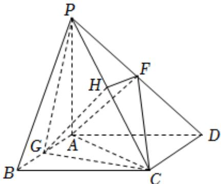
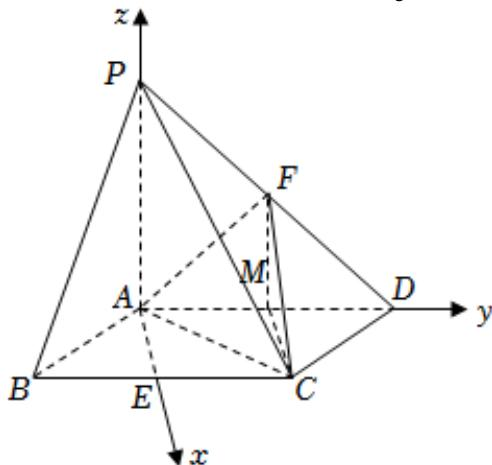

> [!faq]- 2025-2026学年内蒙古包头九中高二（上）期中数学试卷（1）解析
>
> > [!success]- **【答案】** 详见解析
>
> > [!note]- **【解析】**
> > 详见解析
> >
> > (1) 在线段 $AB$ 上存在中点 $G$ ，使得 $AF \parallel$ 平面 $PCG$ .
> >
> > 
> >
> > 证明如下：
> >
> > 设 $PC$ 的中点为 $\pmb{H}$ ，连结 $FH$ ，由题意得 $AGHF$ 为平行四边形，
> >
> > 则 $AF \parallel GH$
> >
> > 又GH⊂平面PGC，AF∉平面PGC，
> >
> > ∴ AF // 平面PGC.
> >
> > (2) $\because PA \perp$ 平面 $ABCD$ , 取 $BC$ 中点 $E$ , 连结 $AE$ , 取 $AD$ 的中点 $M$ , 连结 $FM$ , $CM$ , 则 $FM \parallel PA$ , 且 $FM = 1$ ,
> >
> > $\therefore FM \perp$ 平面 $ABCD, FC$ 与平面 $ABCD$ 所成角为 $\angle FCM, \therefore \angle FCM = \frac{\pi}{6}$
> >
> > 在 $Rt\triangle FCM$ 中， $CM = \sqrt{3}$
> >
> > 又CM = AE, $\therefore AE^{2} + BE^{2} = AB^{2}$ , $\therefore BC \perp AE$ ,
> >
> > ∴ AE, AD, AP彼此两两垂直，
> >
> > 以 $AE$ 、 $AD$ 、 $AP$ 分别为 $\pmb{x}$ ， $\mathbf{y}$ ， $z$ 轴，建立空间直角坐标系，
> >
> > 
> >
> > $$
> > \because P A = A B = 2
> > $$
> >
> > $\therefore A(0,0,0),B(\sqrt{3}, - 1,0),C(\sqrt{3},1,0),D(0,2,0)$
> >
> > $$
> > E (\sqrt {3}, 0, 0), F (0, 1, 1), P (0, 0, 2)
> > $$
> >
> > $$
> > \therefore \overrightarrow {A F} = (0, 1, 1), \overrightarrow {C F} = (- \sqrt {3}, 0, 1)
> > $$
> >
> > 设平面 $FAC$ 的法向量 $\overrightarrow{m} = (x,y,z)$
> >
> > 则 $\left\{ \begin{array}{l} \overrightarrow{m} \bullet \overrightarrow{AF} = y + z = 0 \\ \overrightarrow{m} \bullet \overrightarrow{CF} = -\sqrt{3} x + z = 0 \end{array} \right.$ ，取 $x = \sqrt{3}$ ，得 $\overrightarrow{m} = (\sqrt{3}, -3, 3)$ ，
> >
> > 平面ACD的法向量 $\overrightarrow{n}=(0,0,1)$ ,
> >
> > 设二面角F-AC-D的平面角为 $\theta$ ，
> >
> > $$
> > \cos \theta = \frac {| \overrightarrow {m} \bullet \overrightarrow {n} |}{| \overrightarrow {m} | \bullet | \overrightarrow {n} |} = \frac {\sqrt {2 1}}{7}
> > $$
> >
> > $\therefore$ 二面角 $F - AC - D$ 的余弦值为 $\frac{\sqrt{21}}{7}$ .
