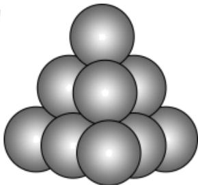

<!-- question-source:start -->
3、南宋数学家杨辉在《详解九章算法·商功》一书中记载的三角垛、方垛、刍甍垛等的求和都与高阶等差数列有关，如图是一个三角垛，最顶层有1个小球，第二层有3个小球，第三层有6个小球，第四层有10个小球……设第n层有 $a_{n}$ 个小球，则 $\frac{1}{a_{1}}+\frac{1}{a_{2}}+\frac{1}{a_{3}}+\cdots+\frac{1}{a_{2025}}$ 的值为\_\_\_\_.

<!-- question-source:end -->

![[Q00091128A1]]
