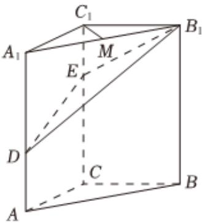

<!-- question-source:start -->
3. 如图，在三棱柱 $ABC-A_{1}B_{1}C_{1}$ 中， $CC_{1}\perp$ 平面ABC，AC⊥BC，AC=BC=2， $CC_{1}=3$ ，点D，E分别在棱 $AA_{1}$ ， $CC_{1}$ 上，且AD=1，CE=2，M为棱 $A_{1}B_{1}$ 的中点.

1 求证： $C_{1}M \perp B_{1}D$ ;

2 求二面角 $B-B_{1}E-D$ 的正弦值.
<!-- question-source:end -->

![[Q00092568A1]]
