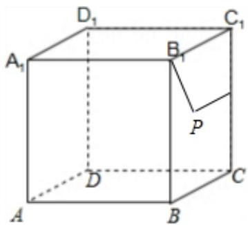

> [!faq]- 2025-2026学年内蒙古包头九中高二（上）段考数学试卷（1月份）解析
>
> > [!success]- **【答案】** D
>
> > [!note]- **【解析】**
> > 点 $P$ 在侧面 $BCC_{1}B_{1}$ 及其边界上运动，且满足到异面直线 $A_{1}B_{1}$ 与 $CC_{1}$ 距离相等，
> >
> > 因为几何体是正方体 $ABCD - A_{1}B_{1}C_{1}D_{1}$ ，所以 $A_{1}B_{1}\bot$ 侧面 $BCC_{1}B_{1}$
> >
> > $P_{到}B_{1}$ 的距离与P到 $A_{1}B_{1}$ 的距离相等，
> >
> > 所以问题转化为 $P$ 到 $B_{1}$ 的距离与到 $CC_{1}$ 距离相等，
> >
> > 所以P的轨迹是抛物线，
> >
> > 故选：D.
> >
> > 
