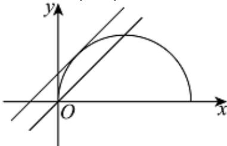

> [!faq]- 2025-2026学年内蒙古包头九中高二（上）段考数学试卷（1月份）解析
>
> > [!success]- **【答案】** B
>
> > [!note]- **【解析】**
> > 根据曲线 $y=\sqrt{2x-x^{2}}$ ，两边平方，整理得 $(x-1)^{2}+y^{2}=1(y\geqslant0)$
> >
> > 表示以 $C(1,0)$ 为圆心、半径等于1的圆的上半圆（含端点），
> >
> > 
> >
> > 当直线 $y = x - m$ 过点(0,0)时，可得m = 0，
> >
> > 此时直线与曲线 $y = \sqrt{2x - x^2}$ 有两个不同的公共点，符合题意；
> >
> > 当直线 $y = x - m$ 和半圆相切时，圆心 $C$ 到直线的距离 $d = r$ ，
> >
> > 即 $\frac{|1 - 0 - m|}{\sqrt{2}} = 1$ ，解得 $m = 1 - \sqrt{2}$ 或 $m = 1 + \sqrt{2}$
> >
> > 结合图形可知此时纵截距 $-m > 0$ ，即 $m < 0$ ，可得 $m = 1 - \sqrt{2}$
> >
> > 因此，直线 $y = x - m$ 与曲线 $y = \sqrt{2x - x^2}$ 有两个不同的公共点时， $0 \leqslant m < 1 - \sqrt{2}$ ，即实数 $m$ 的取值范围为 $(1 - \sqrt{2}, 0]$ .
> >
> > 故选：B.
