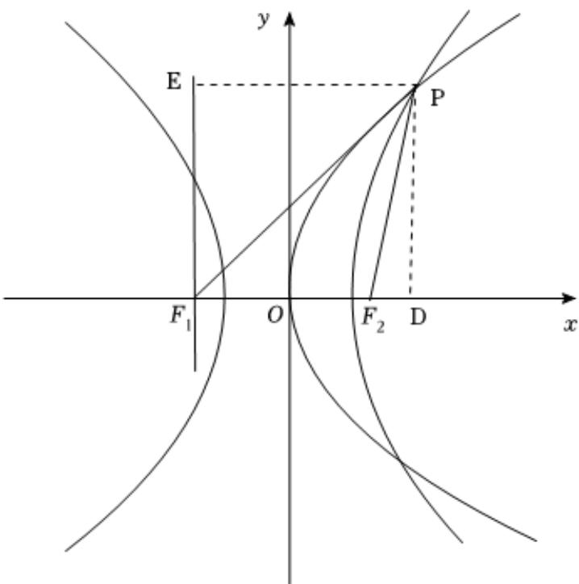

> [!faq]- 2025-2026学年内蒙古包头九中高二（上）段考数学试卷（1月份）解析
>
> > [!success]- **【答案】** A
>
> > [!note]- **【解析】**
> > 如图，抛物线的准线为 $F_{1}E$ ，E为过P作准线的垂线，与准线的交点，过P作x轴的垂线，交点为D，由题意， $|PF_{1}|+|PF_{2}|=3|F_{1}F_{2}|=6c$ ， $|PF_{1}|-|PF_{2}|=2a$ ，
> >
> > 解得 $\left|PF_{1}\right|=3c+a,\left|PF_{2}\right|=3c-a,x_{P}=2c-a,\left|F_{2}D\right|=c-a,\left|EP\right|=3c-a,$
> >
> > $$
> > \sqrt {| P F _ {1} | ^ {2} - | E P | ^ {2}} = \sqrt {| P F _ {2} | ^ {2} - | D F _ {2} | ^ {2}}
> > $$
> >
> > 可得 $(3c + a)^2 - (3c - a)^2 = (3c - a)^2$ $-(c - a)^2$
> >
> > 化简可得2a=c，所以 $e=\frac{c}{a}=2$ .
> >
> > 故选：A.
> >
> > 
