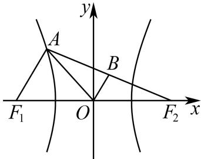

> [!faq]- 2025-2026学年内蒙古包头九中高二（上）段考数学试卷（1月份）解析
>
> > [!success]- **【答案】** BC
>
> > [!note]- **【解析】**
> > 对于选项A，双曲线 $C:\frac{x^{2}}{4}-\frac{y^{2}}{3}=1,a=2,b=\sqrt{3},c=\sqrt{7}$
> >
> > 可得双曲线 $C$ 的离心率 $\pmb{e} = \frac{\pmb{c}}{\pmb{a}} = \frac{\sqrt{3 + 4}}{2} = \frac{\sqrt{7}}{2}$ ，故 $A$ 选项错误；
> >
> > 对于选项B，∵B为 $AF_{2}$ 的中点，∴ $|BF_{2}|=\frac{1}{2}|AF_{2}|$ ， $|OB|=\frac{1}{2}|AF_{1}|$ ，
> >
> > $\therefore |BF_2| - |BO| = \frac{1}{2} |AF_2| - \frac{1}{2} |AF_1| = 2$ ，故 $B$ 选项正确；
> >
> > 对于选项 $C$ ， $\because |OA| = |OF_2|$ ， $\therefore |OA| = |OF_2| = |OF_1|$ ， $\therefore AF_2\bot AF_1$
> >
> > $$
> > \therefore | A F _ {1} | ^ {2} + | A F _ {2} | ^ {2} = | F _ {1} F _ {2} | ^ {2} = 2 8, \because | A F _ {2} | - | A F _ {1} | = 4
> > $$
> >
> > $\therefore \left|AF_{1}\right|^{2} + \left|AF_{2}\right|^{2} - 2\left|AF_{1}\right|\cdot \left|AF_{2}\right| = 16,\therefore \left|AF_{1}\right|\cdot \left|AF_{2}\right| = 6$ ，故 $C$ 选项正确；
> >
> > 对于选项 $D$ ，设点 $\pmb{A}$ 到 $\pmb{x}$ 轴的距离为 $\pmb{h}$ ， $\therefore |F_1F_2|\cdot h = |AF_1|\cdot |AF_2|$
> >
> > $\therefore h = \frac{|AF_1| \cdot |AF_2|}{|F_1F_2|} = \frac{6}{2\sqrt{7}} = \frac{3\sqrt{7}}{7}$ ，故 $D$ 选项错误.
> >
> > 
> >
> > 故选：BC.
