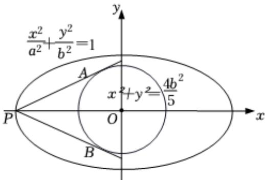

> [!faq]- 2025-2026学年内蒙古包头九中高二（上）段考数学试卷（1月份）解析
>
> > [!success]- **【答案】** $(0, \frac{\sqrt{6}}{4})$
>
> > [!note]- **【解析】**
> > 由题意，如图，
> >
> > 若在椭圆 $C_{1}$ 上不存在点P，使得由点P所作的圆 $C_{2}$ 的两条切线互相垂直，则只需 $\angle APB > 90^{\circ}$ ，即 $\alpha = \angle APO > 45^{\circ}$ ， $\sin\alpha=\frac{\frac{2b}{\sqrt{5}}}{a}>\sin45^{\circ}=\frac{\sqrt{2}}{2}$ 即 $8b^{2}>5a^{2}$ ，因为 $a^{2}=b^{2}+c^{2}$ 解得： $3a^{2}>8c^{2}$ $\therefore e^{2}<\frac{3}{8}$ ，即 $e<\frac{\sqrt{6}}{4}$ ，而0<e<1，
> >
> > 
> >
> > $\therefore 0 < e < \frac{\sqrt{6}}{4}$ , 即 $e \in (0, \frac{\sqrt{6}}{4})$ .
> >
> > 故答案为： $(0, \frac{\sqrt{6}}{4})$
