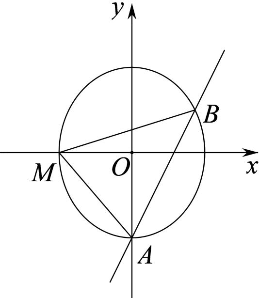

> [!faq]- 2025-2026学年内蒙古包头九中高二（上）段考数学试卷（1月份）解析
>
> > [!success]- **【答案】** 详见解析
>
> > [!note]- **【解析】**
> > 详见解析
> >
> > (2)如图所示，由(1)得椭圆 $C$ 的左顶点为 $M(-\sqrt{3}, 0)$ ，
> >
> > 
> >
> > 联立 $\left\{ \begin{array}{l} \frac{x^2}{3} + \frac{y^2}{4} = 1 \\ 2x - y - 2 = 0 \end{array} \right.$ ，消去 $y$ 得 $2x^{2} - 3x = 0$ ，解得 $x = 0$ 或 $x = \frac{3}{2}$ ，则 $A(0, -2)$ ， $B(\frac{3}{2}, 1)$ ，
> >
> > 所以 $|AB|=\sqrt{(\frac{3}{2}-0)^{2}+(1+2)^{2}}=\frac{3\sqrt{5}}{2}$
> >
> > 则点 $M$ 到直线 $l: 2x - y - 2 = 0$ 的距离为 $d = \frac{|-2\sqrt{3} - 2|}{\sqrt{2^2 + 1^2}} = \frac{2\sqrt{15} + 2\sqrt{5}}{5}$
> >
> > 所以 $S_{\triangle MAB} = \frac{1}{2}|AB|\cdot d = \frac{1}{2}\times \frac{2\sqrt{15} + 2\sqrt{5}}{5}\times \frac{3\sqrt{5}}{2} = \frac{3\sqrt{3} + 3}{2}.$
