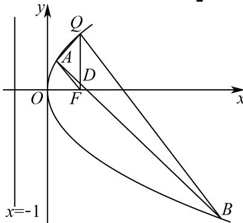

> [!faq]- 2025-2026学年内蒙古包头九中高二（上）段考数学试卷（1月份）解析
>
> > [!success]- **【答案】** 详见解析
>
> > [!note]- **【解析】**
> > 详见解析
> >
> > (1)依题意，抛物线的准线方程为 $x=-\frac{p}{2}$ ，
> > 因为Q在抛物线上，Q点的横坐标是1， $|FQ|=2$ ，
> > 则由抛物线定义可得 $1+\frac{p}{2}=2$ ，所以p=2，
> > 所以抛物线方程为 $y^{2}=4x$ .
> > (2)因为Q在抛物线 $y^{2}=4x$ 上，Q点的横坐标是1，所以点Q的纵坐标为±2，
> > 当点Q的坐标为(1,2)时，
> > 由已知QA的方程为y-2=k₁(x-1)，QB的方程为y-2=k₂(x-1)，
> > 联立 $\left\{\begin{aligned}y^{2}&=4x\\ y&-2=k_{1}(x-1)\end{aligned}\right.$ ，消去x得 $y-2=k_{1}\left(\frac{y^{2}}{4}-1\right)$ ，
> > 即 $k_{1}y^{2}-4y-4k_{1}+8=0,\Delta=16-4k_{1}(8-4k_{1})=16(k_{1}-1)^{2}>0$ 设 $A(x_{1},y_{1})$ ，则 $2+y_{1}=\frac{4}{k_{1}}$ ，故 $y_{1}=\frac{4}{k_{1}}-2$ ，所以 $x_{1}=\left(\frac{2}{k_{1}}-1\right)^{2}$ ，
> > 所以点A的坐标为 $\left(\left(\frac{2}{k_{1}}-1\right)^{2},\frac{4}{k_{1}}-2\right)$ 同理可得点B的坐标为 $\left(\left(\frac{2}{k_{2}}-1\right)^{2},\frac{4}{k_{2}}-2\right)$ 所以直线AB的斜率为 $\frac{\frac{4}{k_{2}}-2-\frac{4}{k_{1}}+2}{\left(\frac{2}{k_{2}}-1\right)^{2}-\left(\frac{2}{k_{1}}-1\right)^{2}}=\frac{\frac{4}{k_{2}}-\frac{4}{k_{1}}}{\left(\frac{2}{k_{2}}-\frac{2}{k_{1}}\right)\left(\frac{2}{k_{2}}+\frac{2}{k_{1}}-2\right)}=\frac{2}{\frac{2}{k_{2}}+\frac{2}{k_{1}}-2}$ 又 $k_{1}+k_{2}=0$ ，所以 $\frac{2}{k_2}+\frac{2}{k_1}=0$ ，所以直线AB的斜率为-1，
> >
> > 
> >
> > 由对称性可得，当点Q的坐标为(1,-2)时，直线AB的斜率为1.
> >
> > (3)设直线 $Q F$ 与直线 $A B$ 的交点为 $\pmb{D}$
> >
> > 则 $\frac{S_1}{S_{\triangle FAD}} = \frac{|QF|}{|FD|} = \frac{2}{|FD|},\frac{S_3}{S_{\triangle FBD}} = \frac{|QF|}{|FD|} = \frac{2}{|FD|}$
> >
> > 所以 $S_{\triangle FAD} = \frac{|FD|}{2} S_1$ ， $S_{\triangle FBD} = \frac{|FD|}{2} S_3$
> >
> > 所以 $S_{2} = S_{\triangle FAB} = S_{\triangle FAD} + S_{\triangle FBD} = \frac{|FD|}{2}(S_{1} + S_{3})$
> >
> > 因为 $S_{1}$ ， $S_{2}$ ， $S_{3}$ 成等差数列，所以 $S_{1} + S_{3} = \overline{2} S_{2}$ ，所以 $|FD| = 1$
> >
> > 当点 $Q$ 的坐标为 $(1,2)$ 时，直线 $AB$ 的方程为 $y - \frac{4}{k_1} + 2 = -(x - \frac{4}{k_1^2} + \frac{4}{k_1} - 1)$ ，
> >
> > 即 $y=-x+\frac{4}{k_{1}^{2}}-1$ ，
> >
> > 令 $x = 1$ 可得， $y = \frac{4}{k_1^2} - 2$ ，故点 $D$ 的坐标为 $\left(1, \frac{4}{k_1^2} - 2\right)$ ，
> >
> > 所以 $\left|\frac{4}{k_{1}^{2}}-2\right|=1$ ，
> >
> > 所以 $\frac{4}{k_1^2} - 2 = 1$ 或 $\frac{4}{k_1^2} - 2 = -1$
> >
> > 所以 $k_{1}^{2}=\frac{4}{3}$ 或 $k_{1}^{2}=4$ ，所以D点坐标为(1,1)或(1,-1)，
> >
> > 所以直线 $AB$ 的方程为 $\pmb{y} = -\pmb{x} + 2$ 或 $\pmb{y} = -\pmb{x}$
> >
> > 同理当点Q的坐标为 $(1,-2)$ 时，直线AB的方程为y=x-2或y=x.
